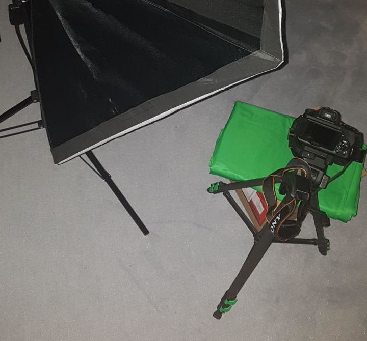

# PhotoScanner
A simple tool to digitalize printed photos using a greenscreen and a DSLR.

## Install
Install the poetry package manager and run the following command.
```
git clone git@github.com:Flova/PhotoScanner.git
cd PhotoScanner
poetry install
```

# Usage
To start the PhotoScanner run `poetry run ./app -h`.

# Setup
The setup should roughly look like this:



A even lighting without reflections on the glossy surface of the photo results in the best quality. The printed image should be captured from the top on a green background.
